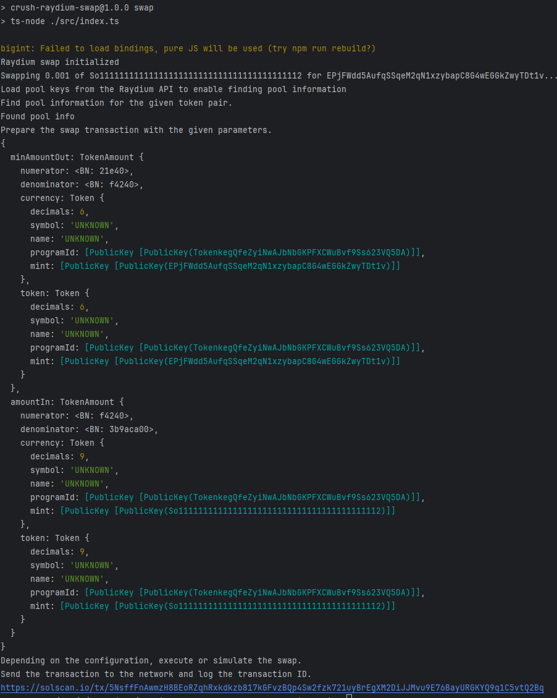

# install

```angular2html
yarn
```

# .env

SOL_RPC_URL=

WALLET_PRIVATE_KEY=


# quick run

```
yarn swap
```

By default, a transaction of 0.001 sol to usdc is executed.

Need other token liquidity information, download the official token list file

Download the latest Raydium mainnet.json to the project root (it's a ~500 MB file):

```
wget https://api.raydium.io/v2/sdk/liquidity/mainnet.json
```

# Run log




```angular2html
https://solscan.io/tx/5NsffFnAwmzH8BEoRZqhRxkdkzb817kGFvzBQp4Sw2fzk721uyBrEgXM2DiJJMvu9E76BayURGKYQ9q1C5vtQ2Bq
```
