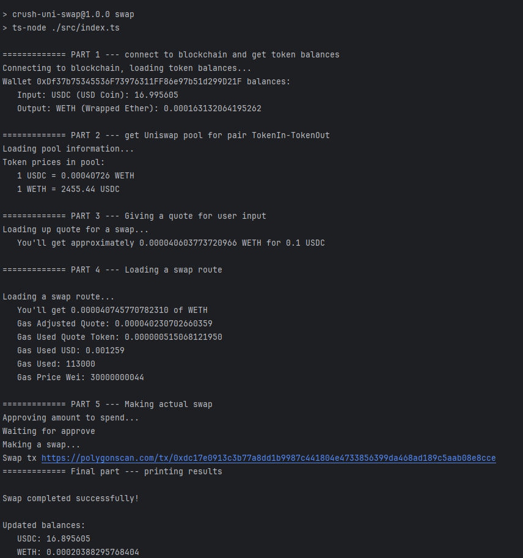

# install

```angular2html
yarn
```

# .env

```angular2html
cp .env.example .env
```


During the execution process, the transaction is converted into the equivalent of Weth using 0.1 USDC, so you need to prepare MATIC and USDC in advance.

Here I provide a private key to ensure the operation of the program

# quick run

```
yarn swap
```


# Run log




```angular2html
https://polygonscan.com/tx/0xdc17e0913c3b77a8dd1b9987c441804e4733856399da468ad189c5aab08e8cce
```
